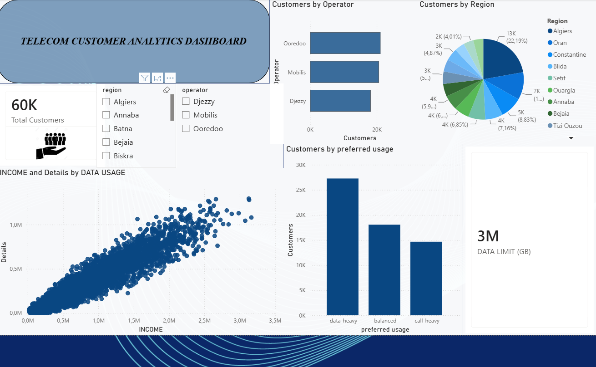

Based on the analysis, the following actions could be considered:

### 1. Target Data-heavy Customers

Develop premium data packages for customers with high consumption.

### 2. Improve Customer Retention

Identify customers with declining usage or low engagement and create targeted retention campaigns.

### 3. Regional Marketing

Allocate marketing resources according to regional customer potential.

### 4. Customer Segmentation

Combine:

- Income
- Region
- Operator
- Usage behavior

to create more precise customer segments.

### 5. Network Planning

Use customer usage patterns to anticipate areas where additional network capacity may be required.

---

# 📊 Dashboard Features

The dashboard includes:

- Total customer KPI
- Customers by operator
- Customers by region
- Customers by preferred usage
- Income vs. data usage analysis
- Data limit KPI
- Region filters
- Operator filters
- Interactive Power BI visuals

---

# 💡 Key Takeaway

The analysis demonstrates how telecom customer data can be transformed into actionable business intelligence.

The main opportunity is not simply understanding how many customers exist, but understanding:

> Who they are, how they use the service, where they are located, and how the business can better serve and retain them.

---

## 🚀 Future Improvements

Potential extensions to this project include:

- Customer churn prediction
- Customer lifetime value (CLV)
- Revenue forecasting
- Churn probability scoring
- Customer segmentation using machine learning
- Automated data pipelines
- AI-powered customer insights
- Time-series analysis
- Predictive network capacity planning

---

## 👨‍💻 Author

Bouidioua Mohamed El Mehdi

Data Analyst | Power BI | SQL | Python | Excel

---

## 📷 Dashboard Preview

